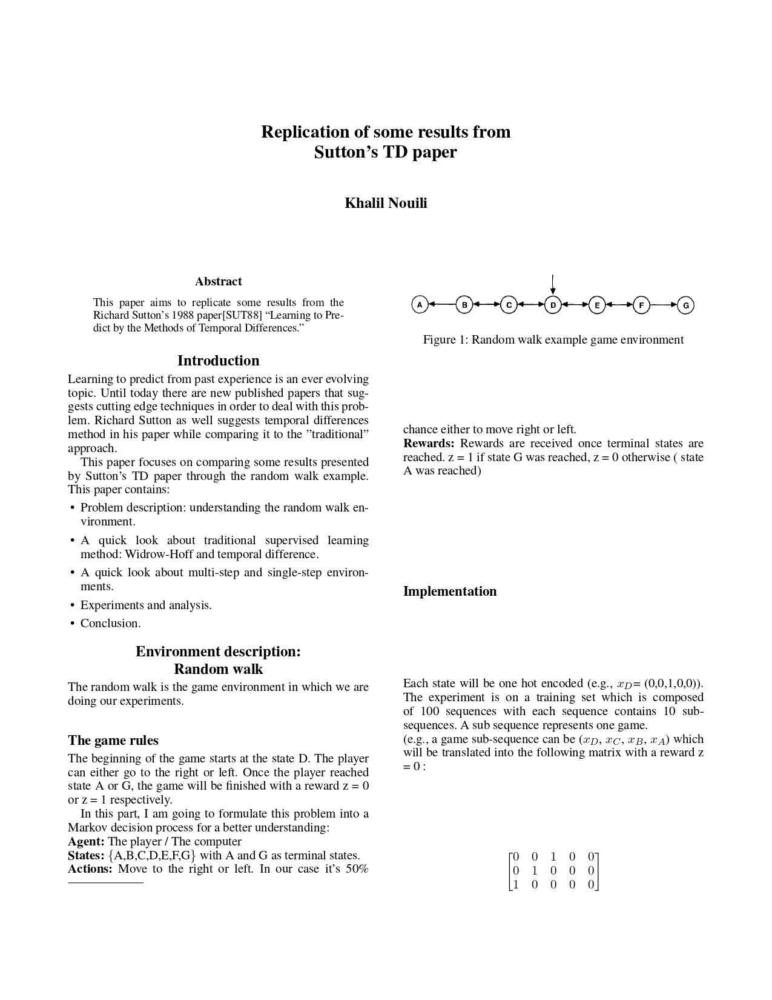
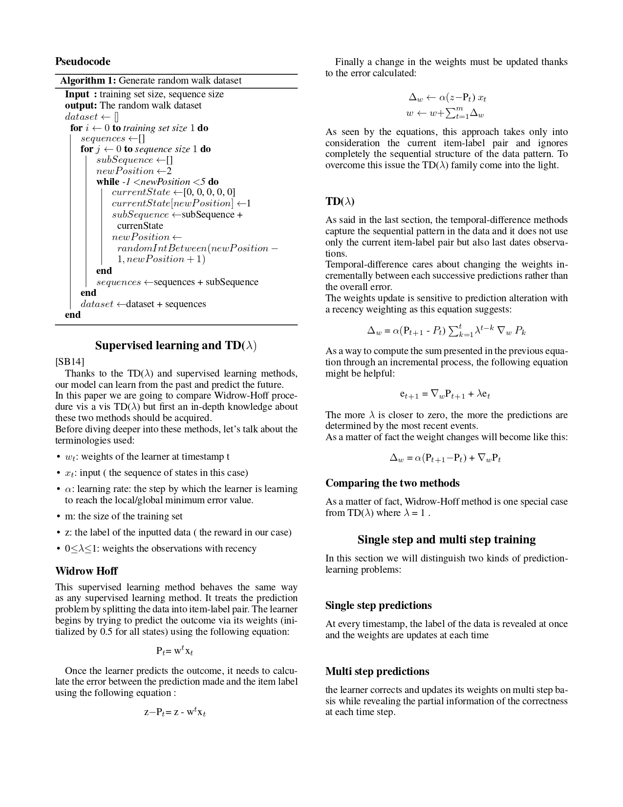
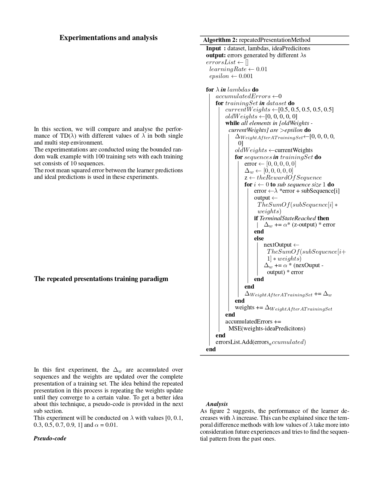
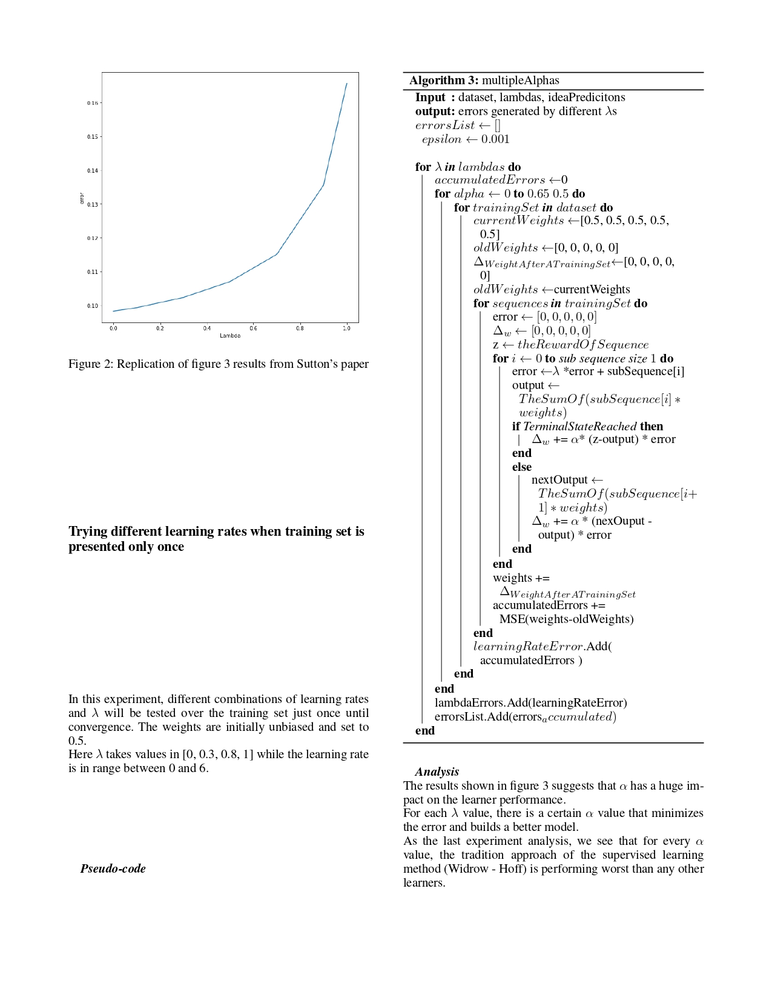
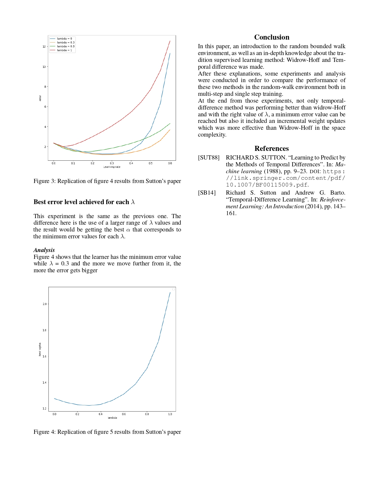

# TD learning in random walk environment (RL)

This project aims to replicate figure 3, 4 and 5 from the Richard Sutton’s 1988 paper [“Learning to Predict by the Methods of Temporal Differences.”](https://www.researchgate.net/publication/225264698_Learning_to_Predict_by_the_Method_of_Temporal_Differences)


## Getting Started

These instructions will get you a copy of the project up and running on your local machine.
### Prerequisites

In order to get this prpject running on our machine, you need to have

```
Python v3.6
Jupyter-notebook
```

### Installing

After setting up the environmnet, you need to install the used python libraries in this project

```
 pip3 install -r requirements.txt
```

## Run the project

using Jupyter-notebook, open TD.ipynb file.


## More about the project 






